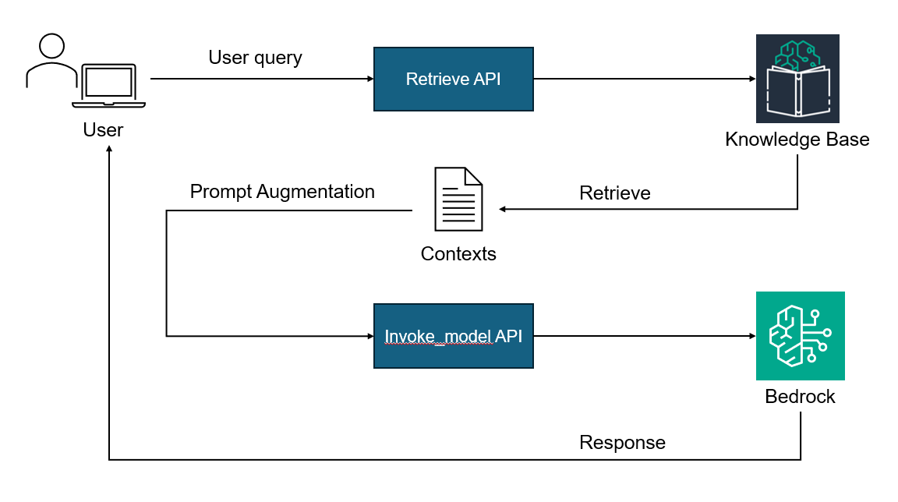

# Knowledge Bases for Amazon Bedrock を利用した RAG のベースライン<!-- omit in toc -->

本リポジトリでは，Knowledge Base(OpenSearch Serverless) および Bedrock を利用した RAG の Python 実装（ベースライン）を公開している．LLM，Retriever, PromptConfig というクラスを定義し，可能な限りシンプルに実装している．

## TL;DR<!-- omit in toc -->

- boto3 ベースでの シンプルな RAG の実装を行った（以下概要図）．
- Command R+ と Claude3 Opus などのモデルを利用可能．
  - streaming にも対応．
- LLM の引数設定，プロンプトなどは yaml ファイルで管理している．



## 目次<!-- omit in toc -->

- [背景](#背景)
- [目的](#目的)
- [オリジナリティ](#オリジナリティ)
- [前提](#前提)
- [手順](#手順)
- [手順の各ステップの詳細](#手順の各ステップの詳細)
  - [Knowledge Base for Amazon Bedrock の構築（スキップ可能）](#knowledge-base-for-amazon-bedrock-の構築スキップ可能)
  - [RAG による質問応答の実行](#rag-による質問応答の実行)
  - [CleanUp（スキップ可能）](#cleanupスキップ可能)
- [Next Step](#next-step)
- [References](#references)

## 背景

昨今， Bedrock を利用した実装・記事が多様に公開されているが，その多くでは LangChain が利用されている．LangChain を利用することでシンプルかつ少ない記述で RAG を実装できるが，初学者にとっては中身のロジックが分かりづらい．加えて，本番環境において，バージョンアップデートによる影響が大きい LangChain を利用することはリスクが高い．そこで，本リポジトリでは LangChain を利用せず，boto3 のみを利用して シンプルな RAG を実装した．

## 目的

boto3 のみを利用してシンプルな RAG を実装する．また，Python スクリプトベースで実装し，初学者にも理解しやすく，実用的なベースラインを公開する．

## オリジナリティ

- LangChain を利用せず，boto のみを利用して実装している．
- Knowledge Base を Retrieve API 経由で利用することで，Claude3 Opus や Command R+で質問応答を行っている．
  - 執筆時点（2024/05/01）では，Knowledge Base は上記のモデルをサポートしていない[^1]．
- 利用する LLM を容易に切り替えられるようシンプルな設計にしている．
  - LLM，Retriever, PromptConfig というクラスを定義しており，機能追加に対して柔軟に対応できるようにしている．
- LLM の設定，プロンプトなどは yaml ファイルで管理している．
  - MLflow などと組み合わせることで，実験管理が容易になると考えられる．

## 前提

- オレゴンリージョン（`us-west-2`）での実行を前提としている．
- `requirements.txt` に記載のライブラリがインストールされている．
  - `pip install -r requirements.txt` でインストール可能．
- `適切な認証情報の設定・ロールの設定がなされている．
  - 設定が面倒な場合，Cloud9 上で実行しても良い．

## 手順

- Knowledge Base for Amazon Bedrock の構築（スキップ可能）
- RAG による質問応答の実行
- CleanUp（スキップ可能）

## 手順の各ステップの詳細

### Knowledge Base for Amazon Bedrock の構築（スキップ可能）

[`./notebook/0_create_ingest_documents_test_kb.ipynb`](https://github.com/ren8k/aws-bedrock-rag-baseline/blob/main/notebook/0_create_ingest_documents_test_kb.ipynb)を全て実行し，Knowledge Base for Amazon Bedrock を構築する．本ノートブックでは，以下を実行する．（既存の Knowledge Base を利用する場合はスキップ可能．）

- Amazon S3 からデータにアクセスし、OpenSearch Serverless に embeddings を保存するためのポリシーおよび実行ロールを作成
- OpenSearch Serverless の空のインデックスを作成
- ドキュメントをローカルにダウンロードし、Amazon S3 にアップロード
  - ドキュメントは，2019~2022 年度の Amazon の株主向け年次報告書である
- Knowledge Base を作成
- start_ingestion_job API を利用し，Knowledge Base にデータをインポート
  - S3 からデータを取り込み，チャンク分割し，Amazon Titan Embeddings モデルにより embedding に変換し，これらの embedding を AOSS に保存する

なお，上記のノートブックに関しては AWS の公式リポジトリ[^2]のノートブックをほぼ流用させていただいております．作成者の方には感謝申し上げます．

### RAG による質問応答の実行

検索したい内容やプロンプトの雛形を yaml ファイルに定義しておき，python スクリプト（[`main.py`](https://github.com/ren8k/aws-bedrock-rag-baseline/blob/main/src/main.py)）を実行することで，RAG による質問応答を行う．

- 検索したい事項を[`./config/query/query.yaml`](https://github.com/ren8k/aws-bedrock-rag-baseline/blob/main/config/query/query.yaml)に記載する．
  <details>
  <summary>query.yamlの中身（例）</summary>
  <br/>

  ```yaml
  "query": "What is Amazon doing in the field of generative AI?"
  ```

  </details>
  <br/>

- プロンプトテンプレートを[`./config/prompt_template/prompt_template.yaml`](https://github.com/ren8k/aws-bedrock-rag-baseline/blob/main/config/prompt_template/prompt_template.yaml)に記載する．

  - 検索したい事項が`{query}`に，Knowledge Base から Retrieve した内容が`{contexts}`に入るように実装している．
  <details>
  <summary>prompt_template.yamlの中身（例）</summary>
  <br/>

  ```yaml
  "template": |
    Human: You are a financial advisor AI system, and provides answers to questions by using fact based and statistical information when possible.
    Use the following pieces of information to provide a concise answer to the question enclosed in <question> tags.
    If you don't know the answer, just say that you don't know, don't try to make up an answer.
    <context>
    {contexts}
    </context>

    <question>
    {query}
    </question>

    The response should be specific and use statistics or numbers when possible.

    Assistant:
  ```

  </details>
  <br/>

- LLM の設定（`bedrock_runtime.invoke_model`の引数等）を[`./config/llm`](https://github.com/ren8k/aws-bedrock-rag-baseline/blob/main/config/llm)ディレクトリ内の yaml ファイルに記載する．以下に，Claude3 Opus を利用する場合の例を解説する．

  - 設定ファイルとしては[`./config/llm/claude-3_cofig.yaml`](https://github.com/ren8k/aws-bedrock-rag-baseline/blob/main/config/llm/claude-3_cofig.yaml)を利用する．
  - 引数の他，`stream` 機能を利用するかどうか，`model_id` を記載する．
  - `messages`には{prompt}を含むように記載する
    - 利用する LLM により引数の要素が異なるため，適宜公式ドキュメント[^3]を参照すること．
    - 例えば，Command R+の場合は，Claude3 とは異なり，プロンプトを`message`に記載する．（`messages`ではない）
    <details>
    <summary>claude-3_cofig.yamlの中身（例）</summary>
    <br/>

  ```yaml
  "anthropic_version": "bedrock-2023-05-31"
  "max_tokens": 1000
  "temperature": 0
  "system": "Respond only in Japanese"
  "messages":
    [{ "role": "user", "content": [{ "type": "text", "text": "{prompt}" }] }]
  "stop_sequences": ["</output>"]

  "stream": false
  "model_id": "anthropic.claude-3-opus-20240229-v1:0"
  ```

  </details>
  <br/>
  <details>
  <summary>command-r-plus_config.yamlの中身（例）</summary>
  <br/>

  ```yaml
  "max_tokens": 1000
  "temperature": 0
  "message": "{prompt}"
  "chat_history":
    [
      { "role": "USER", "message": "Respond only in Japanese" },
      {
        "role": "CHATBOT",
        "message": "Sure. What would you like to talk about?",
      },
    ]
  "stop_sequences": ["</output>"]

  "stream": true
  "model_id": "cohere.command-r-plus-v1:0"
  ```

  </details>
  <br/>

- 利用する Knowledge Base の ID を確認する
  <details>
  <summary>Knowledge Base の IDの確認（例）</summary>
  <br/>

  

  </details>
  <br/>

- [`./src`](https://github.com/ren8k/aws-bedrock-rag-baseline/blob/main/src)ディレクトリに移動し，`python main.py --kb-id <Knowledge Base の ID>`を実行する
  - LLM，Retriever, PromptConfig というクラスを定義している
  - 利用する LLM の設定ファイルは，[`main.py`](https://github.com/ren8k/aws-bedrock-rag-baseline/blob/main/src/main.py)の 35, 36 行目で指定している

### CleanUp（スキップ可能）

[`./notebook/0_create_ingest_documents_test_kb.ipynb`](https://github.com/ren8k/aws-bedrock-rag-baseline/blob/main/notebook/0_create_ingest_documents_test_kb.ipynb)の下部に`CleanUp`セクションがある．セクションのコメントアウトを外し実行することで，ノートブック上部で作成したリソースを全て削除する．

## Next Step

- Advanced RAG への拡張
  - 公式ブログ[^6]を参考にすると良いかも
- DB 格納前の工夫
  - [セクション毎にチャンク分割するための工夫](https://qiita.com/Naoki_Ishihara/items/9f1b852917de19141847)が必要か？
    - RAG の評価も参考になるかも
  - 日本語ドキュメントの場合 NFKC 正規化しておくほうが良いか？
  - 非同期処理は[本記事](https://qiita.com/ShotaOki/items/3198eb695e1c6aa8cdaa)が参考になるかも
- Command R+ 特有の検索クエリの生成および Retrieve した結果を引数`documents`に辞書形式で渡した場合の精度検証
  - AWS 公式ドキュメント[^4]によると，辞書内の文字列の合計単語数は 300 words 未満に抑えることを推奨しており，単に Retrieve した結果をそのまま引数`documents`に格納すると性能低下する可能性あり？
- 引用部分の提示
  - qiita の記事[^5]などを参考にすると良いかも
- LangChain でも実装してみたい
  - OpenAI API との切り替えなども楽そう
- Knowlwdge base の IaC 化
  - CDK or CloudFormation
- アプリケーション化
- MLflow などと組み合わせた実験管理

## References

[^1]: [Amazon Bedrock のナレッジベースでサポートされているリージョンとモデル](https://docs.aws.amazon.com/ja_jp/bedrock/latest/userguide/knowledge-base-supported.html)
[^2]: [aws-samples/amazon-bedrock-workshop](https://github.com/aws-samples/amazon-bedrock-workshop)
[^3]: [Anthropic Claude Messages API](https://docs.aws.amazon.com/bedrock/latest/userguide/model-parameters-anthropic-claude-messages.html)
[^4]: [Cohere Command R および Command R+ モデル](https://docs.aws.amazon.com/bedrock/latest/userguide/model-parameters-cohere-command-r-plus.html)
[^5]: [Amazon Bedrock に Cohere Command R と Command R+ が来たよ！RAG がすげーよ！](https://qiita.com/moritalous/items/16797ea9d82295f40b5e)
[^6]: [Amazon Kendra と Amazon Bedrock で構成した RAG システムに対する Advanced RAG 手法の精度寄与検証](https://aws.amazon.com/jp/blogs/news/verifying-the-accuracy-contribution-of-advanced-rag-methods-on-rag-systems-built-with-amazon-kendra-and-amazon-bedrock/)
