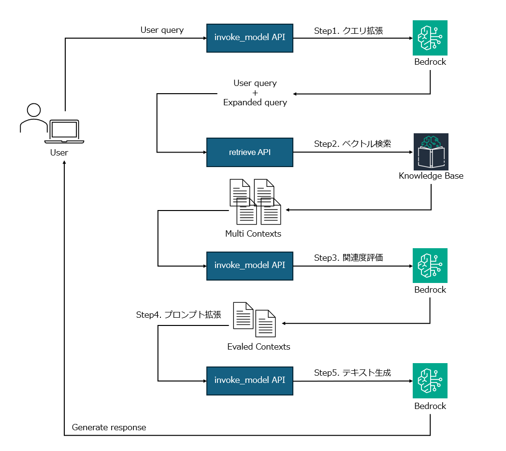
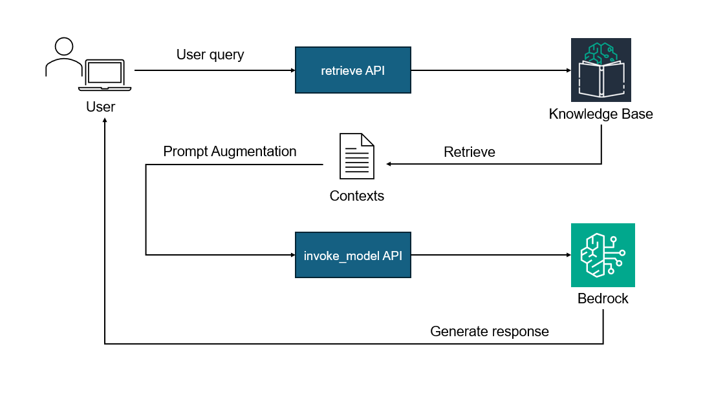

# Knowledge Bases for Amazon Bedrock を利用した Advanced RAG のベースライン<!-- omit in toc -->

本リポジトリでは，2024/05/01 に公開された AWS 公式ブログ「[Amazon Kendra と Amazon Bedrock で構成した RAG システムに対する Advanced RAG 手法の精度寄与検証](https://aws.amazon.com/jp/blogs/news/verifying-the-accuracy-contribution-of-advanced-rag-methods-on-rag-systems-built-with-amazon-kendra-and-amazon-bedrock/)」[^0-0]で紹介されている Advanced RAG の再現実装（Python）を公開している．なお，本実装は先日公開した[リポジトリ](https://github.com/ren8k/aws-bedrock-rag-baseline)[^0-1]をベースとしており，Naive RAG，Advanced RAG の両方を試行できるコードを用意している．

## TL;DR<!-- omit in toc -->

- boto3 ベースで Advanced RAG の実装を行った（以下概要図）．
- AWS 公式ブログ[^0-0]で言及されている，非同期処理による LLM，Retriever の並列実行にも取り組んでいる．
- Claude3 Haiku，Command R+ を利用した Advanced RAG に対応しており，その他のモデルの利用拡張も容易に行える設計である．
- LLM の引数設定，プロンプトなどは yaml ファイルで管理している．



## 目次<!-- omit in toc -->

- [背景](#背景)
- [目的](#目的)
- [オリジナリティ](#オリジナリティ)
- [前提](#前提)
- [手順](#手順)
- [手順の各ステップの詳細](#手順の各ステップの詳細)
  - [Knowledge Base for Amazon Bedrock の構築（スキップ可能）](#knowledge-base-for-amazon-bedrock-の構築スキップ可能)
  - [Advanced RAG による質問応答の実行](#advanced-rag-による質問応答の実行)
    - [実行例](#実行例)
    - [advanced\_rag.py のアルゴリズム](#advanced_ragpy-のアルゴリズム)
  - [Naive RAG による質問応答の実行](#naive-rag-による質問応答の実行)
    - [実行例](#実行例-1)
- [Next Step](#next-step)
- [References](#references)

## 背景

Advanced RAG の方法論などをまとめた記事は多く存在するが，本日時点（2024/05/06）において，その実装例は非常に少ない．特に，boto3 を利用した Advanced RAG の実装例は極めて少ない．本リポジトリでは boto3 のみを利用し，AWS 公式ブログ[^0-1]を参考に Advanced RAG および Naive Rag を実装した．

## 目的

boto3 のみを利用して Advanced RAG および Naive Rag を実装することで，Advanced RAG の理解を深める．また，Python スクリプトベースで実装し，初学者にも理解しやすく，実用的なベースラインを公開する．

## オリジナリティ

- LangChain を利用せず，boto3 のみを利用して実装している．
- Knowledge Base を Retrieve API 経由で利用することで，Claude3 Haiku や Command R+で質問応答を行っている．
- 利用する LLM を容易に切り替えられるようシンプルな設計にしている．
  - LLM，Retriever, PromptConfig というクラスを定義しており，機能追加に対して柔軟に対応できるようにしている．
- LLM の設定，プロンプトなどは yaml ファイルで管理している．
  - MLflow などと組み合わせることで，実験管理が容易になると考えられる．

## 前提

- バージニア北部リージョン（`us-east-1`）での実行を前提としている．
- Knowledge Base の DB としては，Pinecone を利用している．
  - Pinecone 無料枠を利用することで，ランニングコストゼロでベクトルデータベースを構築・維持可能．
- `requirements.txt` に記載のライブラリがインストールされている．（Python3.10 以上を推奨）
  - `pip install -r requirements.txt` でインストール可能．
- 適切な認証情報の設定・ロールの設定がなされている．
  - 設定が面倒な場合，Cloud9 上で実行しても良い．
- Bedrock のモデルアクセスの有効化が適切になされている．
  - 本リポジトリ上のコードでは，Claude3 Haiku, Command R+ を利用している．

## 手順

可能な限り検証コストを抑えるため，Pinecone の無料枠を利用して Knowledge Base を構築し，Advanced RAG を実現した．手順は以下の通りである．

- Pinecone を利用した Knowledge Base for Amazon Bedrock の構築（スキップ可能）
- Advanced RAG による質問応答の実行
- Naive RAG による質疑応答の実行

## 手順の各ステップの詳細

### Knowledge Base for Amazon Bedrock の構築（スキップ可能）

本記事[^2-0][^2-1]を参考に，Pinecone アカウントの作成，ベクター DB のインデックスの作成を行う．以下に注意点，および Knowledge Base 作成時の設定を示す．

- 無料枠の場合，バージニア北部(us-east-1)リージョンのみ利用可能である．
- 埋め込みモデルとして`Cohere-embed-multilingual-v3.0`を利用する．
- バージニア北部リージョンにて Secrets Manager を作成し，Pinecone の API キーを保存する．
- 簡単のため，データソースの S3 には以下の 2020 ~ 2023 年度の Amazon の株主向け年次報告書を格納し，これを Embedding vector に変換している．
  - [AMZN-2022-Shareholder-Letter.pdf](https://s2.q4cdn.com/299287126/files/doc_financials/2023/ar/2022-Shareholder-Letter.pdf)
  - [AMZN-2021-Shareholder-Letter.pdf](https://s2.q4cdn.com/299287126/files/doc_financials/2022/ar/2021-Shareholder-Letter.pdf)
  - [AMZN-2020-Shareholder-Letter.pdf](https://s2.q4cdn.com/299287126/files/doc_financials/2021/ar/Amazon-2020-Shareholder-Letter-and-1997-Shareholder-Letter.pdf)
  - [AMZN-2019-Shareholder-Letter.pdf](https://s2.q4cdn.com/299287126/files/doc_financials/2020/ar/2019-Shareholder-Letter.pdf)

### Advanced RAG による質問応答の実行

検索したい内容やプロンプトの雛形を yaml ファイルに定義しておき，python スクリプト（[`advanced_rag.py`](https://github.com/ren8k/aws-bedrock-advanced-rag-baseline/blob/main/src/advanced_rag.py)）を実行することで，Advanced RAG による質問応答を行う．なお，利用しているプロンプトについては AWS 公式ブログ[^0-0]のものを利用している．以降，実行例およびコードの解説を行う．

#### 実行例

[`./src`](https://github.com/ren8k/aws-bedrock-advanced-rag-baseline/tree/main/src)ディレクトリに移動し，以下を実行する．

```
python advanced_rag.py --kb-id <Knowledge Base の ID> --relevance-eval
```

以下に`advanced_rag.py`におけるコマンド引数の説明を行う．

| 引数               | 説明                                                          |
| ------------------ | ------------------------------------------------------------- |
| `--kb-id`          | Knowledge Base の ID                                          |
| `--relevance-eval` | 検索結果の関連度評価を行うか否か（`sotre_true`）              |
| `--region`         | リージョン（default: `us-east-1`）                            |
| `--config-path`    | 設定ファイルパス（default: `../config/config_claude-3.yaml`） |

引数`--config-path`では，Advanced RAG で利用する LLM の設定ファイルやプロンプトテンプレートのパスを定義している．本リポジトリでは，以下の config ファイルを用意している．

- [`config/config_claude-3.yaml`](https://github.com/ren8k/aws-bedrock-advanced-rag-baseline/blob/main/config/config_claude-3.yaml): Claude3 Haiku 用の cofig ファイル
- [`config/config_command-r-plus.yaml`](https://github.com/ren8k/aws-bedrock-advanced-rag-baseline/blob/main/config/config_command-r-plus.yaml): Command R+ 用の cofig ファイル

#### advanced_rag.py のアルゴリズム

記事[^0-0]の内容に従い，以下のフローで Advanced RAG を実行している．

```
step1. クエリ拡張
step2. ベクトル検索
step3. ベクトル検索結果の関連度評価
step4. step3で絞り込んだ結果を元に，プロンプト拡張
step5. LLMによるテキスト生成
```

また，各 step で利用している config ファイルは以下の通りである（LLM を利用する step で config ファイルを用意している）．なお，以下の表では利用する LLM として Claude3 Haiku を利用する場合の config ファイルを示している．以降，Claude 3 Haiku を利用する前提で解説を行う．

| step  | 処理内容       | config ファイル                                                                                                                                                                                                                                                                                                                                                                                                                                                      |
| ----- | -------------- | -------------------------------------------------------------------------------------------------------------------------------------------------------------------------------------------------------------------------------------------------------------------------------------------------------------------------------------------------------------------------------------------------------------------------------------------------------------------- |
| step1 | クエリ拡張     | - [`config/query/query.yaml`](https://github.com/ren8k/aws-bedrock-advanced-rag-baseline/blob/main/config/query/query.yaml)<br>- [`config/prompt_template/query_expansion.yaml`](https://github.com/ren8k/aws-bedrock-advanced-rag-baseline/blob/main/config/prompt_template/query_expansion.yaml) <br>- [`config/llm/claude-3_query_expansion.yaml`](https://github.com/ren8k/aws-bedrock-advanced-rag-baseline/blob/main/config/llm/claude-3_query_expansion.yaml) |
| step2 | ベクトル検索   | ---                                                                                                                                                                                                                                                                                                                                                                                                                                                                  |
| step3 | 関連度評価     | - [`config/prompt_template/relevance_eval.yaml`](https://github.com/ren8k/aws-bedrock-advanced-rag-baseline/blob/main/config/llm/claude-3_relevance_eval.yaml) <br>- [`config/llm/claude-3_relevance_eval.yaml`](https://github.com/ren8k/aws-bedrock-advanced-rag-baseline/blob/main/config/prompt_template/relevance_eval.yaml)                                                                                                                                    |
| step4 | プロンプト拡張 | ---                                                                                                                                                                                                                                                                                                                                                                                                                                                                  |
| step5 | テキスト生成   | - [`config/config/prompt_template/rag.yaml`](https://github.com/ren8k/aws-bedrock-advanced-rag-baseline/blob/main/config/llm/claude-3_rag.yaml) <br>- [`config/llm/claude-3_rag.yaml`](https://github.com/ren8k/aws-bedrock-advanced-rag-baseline/blob/main/config/prompt_template/rag.yaml)                                                                                                                                                                         |

以降，各ステップにおける処理と各ステップで利用する cofig ファイルについて説明する．

<details>
<summary>step1. クエリ拡張</summary>
　単一のクエリを表記揺れや表現などを考慮した複数のクエリに拡張することで，多様な検索結果を取得する．これにより，生成される回答の適合性を高めることを狙いとしている．以下のconfigファイルに検索したい事項やプロンプトテンプレートを定義する．

- `config/query/query.yaml`: 検索したい事項（この内容が拡張される）
- `config/prompt_template/query_expansion.yaml`: クエリ拡張のためのプロンプトテンプレート
- `config/llm/claude-3_query_expansion.yaml`: Claude3 の設定

本実装では，Claude3 Haiku に対して json 形式で拡張したクエリを出力させるため，以下の工夫を行っている．

- プロンプトでは，JSON 形式での出力を指定
- Claude3 の引数 messages では，prefill の Assistant フィールドに`{`を指定[^2-2]
- Claude3 の引数 system でも同様に，json 形式での出力を指定
- json 形式で取得できなかった場合は再度 Claude3 Haiku にリクエストを送信（リトライ）するように実装

実際にクエリ拡張際に得られるクエリ(例)を以下に示す．

```json
{
  "query_1": "Amazon generative AI models language GPT-3 Alexa",
  "query_2": "Amazon generative AI 生成モデル 自然言語処理 AI",
  "query_3": "Amazon generative AI 言語生成 人工知能 AI技術"
}
```

<br>

以下に各 config ファイルを示す．

**`config/query/query.yaml`**

```yaml
query: "What is Amazon doing in the field of generative AI?"
```

<br>

**`config/prompt_template/query_expansion.yaml`**

```yaml
retries: 3
n_queries: 3
output_format: JSON形式で、各キーには単一のクエリを格納する。
template: |
  検索エンジンに入力するクエリを最適化し、様々な角度から検索を行うことで、より適切で幅広い検索結果が得られるようにします。
  具体的には、類義語や日本語と英語の表記揺れを考慮し、多角的な視点からクエリを生成します。

  以下の<question>タグ内にはユーザーの入力した質問文が入ります。
  この質問文に基づいて、{n_queries}個の検索用クエリを生成してください。
  各クエリは 30 トークン以内とし、日本語と英語を適切に混ぜて使用することで、広範囲の文書が取得できるようにしてください。

  生成されたクエリは、<format>タグ内のフォーマットに従って出力してください。

  <example>
  question: Knowledge Bases for Amazon Bedrock ではどのベクトルデータベースを使えますか？
  query_1: Knowledge Bases for Amazon Bedrock vector databases engine DB
  query_2: Amazon Bedrock ナレッジベース ベクトルエンジン vector databases DB
  query_3: Amazon Bedrock RAG 検索拡張生成 埋め込みベクトル データベース エンジン
  </example>

  <format>
  {output_format}
  </format>

  <question>
  {question}
  </question>
```

<br>

**`config/prompt_template/query_expansion.yaml`**

```yaml
anthropic_version: bedrock-2023-05-31
max_tokens: 1000
temperature: 0
system: Respond valid json format.
# https://docs.anthropic.com/claude/docs/control-output-format#prefilling-claudes-response
messages:
  [
    { "role": "user", "content": [{ "type": "text", "text": "{prompt}" }] },
    { "role": "assistant", "content": [{ "type": "text", "text": "{" }] },
  ]
stop_sequences: ["</output>"]
stream: false
model_id: anthropic.claude-3-haiku-20240307-v1:0
```

</details>

<details>
<summary>step2. ベクトル検索</summary>
　step1.で拡張した複数のクエリを利用して，Knowledge Base でベクトル検索を行う．本実装では，元のクエリと拡張した 3 つのクエリの計 4 つのクエリで独立に検索を行い，検索毎に 5 件の抜粋を取得しているので，計 20 件分の抜粋を Retrieve している．
また，AWS 公式ブログ[^0-0]でも言及されている通り，各クエリの検索は`concurrent.futures.ThreadPoolExecutor `を利用して並列実行している．

```python
@classmethod
def retrieve_parallel(
    cls,
    kb_id: str,
    region: str,
    queries: dict,
    max_workers: int = 10,
    no_of_results: int = 5,
) -> dict:
    retriever = cls(kb_id, region)
    results = {}

    with concurrent.futures.ThreadPoolExecutor(max_workers) as executor:
        futures = {
            executor.submit(retriever.retrieve, query, no_of_results): key
            for key, query in queries.items()
        }
        for future in concurrent.futures.as_completed(futures):
            key = futures[future]
            try:
                result = future.result()
            except Exception as e:
                results[key] = str(e)
            else:
                results[key] = result
    return results
```

</details>

<details>
<summary>step3. 関連度評価</summary>
　step2での検索結果が，元のユーザーからの質問（クエリ）に関連したものになっているかを評価する．検索で得られた抜粋内に誤った回答を誘発しうる情報がある場合，それを排除することにより，回答の精度が向上すると考えられる．

本実装では，Claude3 Haiku を利用し，全ての検索結果の抜粋に対して質問者のクエリとの関連度を評価している．また，step2 と同様，非同期処理による並列実行により，効率的に処理を行っている．（以下に該当部分を示す．ここでは，10 並列で処理を行っている．）また，Claude3 は，`True` または `False` のバイナリスコアを返すようにプロンプトを工夫しており，`True` の場合は関連があると判断し，`False` の場合は関連がないと判断している．

```python
@classmethod
def eval_relevance_parallel(
    cls,
    region: str,
    llm_conf: LLMConfig,
    prompts_and_contexts: list,
    max_workers: int = 10,
) -> list:
    results = []

    def generate_single_message(
        llm: LLM, llm_conf: LLMConfig, prompt_and_context: dict
    ):
        llm_conf_tmp = copy.deepcopy(llm_conf)
        llm_conf_tmp.format_message(prompt_and_context["prompt"])
        body = json.dumps(llm_conf_tmp.llm_args)
        is_relevant = llm.generate_message(body)

        if is_relevant == "True":
            return prompt_and_context["context"]
        else:
            return None

    llm = cls(region, llm_conf.model_id)

    with ThreadPoolExecutor(max_workers) as executor:
        futures = {
            executor.submit(
                generate_single_message, llm, llm_conf, prompt_and_context
            ): prompt_and_context
            for prompt_and_context in prompts_and_contexts
        }
        for future in as_completed(futures):
            result = future.result()
            if result:
                results.append(result)

    return results
```

以下に利用している cofig ファイルを示す．

**`config/prompt_template/relevance_eval.yaml`**

```yaml
format_instructions: TrueまたはFalseのみ回答すること。
template: |
  あなたは、ユーザーからの質問と検索で得られたドキュメントの関連度を評価する専門家です。
  <excerpt>タグ内は、検索により取得したドキュメントの抜粋です。

  <excerpt>{context}</excerpt>

  <question>タグ内は、ユーザーからの質問です。

  <question>{question}</question>

  このドキュメントの抜粋は、ユーザーの質問に回答するための正確な情報を含んでいるかを慎重に判断してください。
  正確な情報を含んでいる場合は 'yes'、含んでいない場合は 'no' のバイナリスコアを返してください。

  {format_instructions}
```

<br>

**`config/llm/claude-3_relevance_eval.yaml`**

```yaml
anthropic_version: bedrock-2023-05-31
max_tokens: 1000
temperature: 0
system: Respond only true or false.
messages:
  [{ "role": "user", "content": [{ "type": "text", "text": "{prompt}" }] }]
stop_sequences: ["</output>"]

stream: false
model_id: anthropic.claude-3-haiku-20240307-v1:0
```

</details>

<details>
<summary>step4. プロンプト拡張</summary>
　step3. で最終的に Claude3 が `True` と判断した抜粋のみを抽出し，これを元にプロンプトを拡張する．本ステップは Naive Rag でのプロンプト拡張と同様の考え方である．

</details>

<details>
<summary>step5. テキスト生成</summary>
　step4. で拡張したプロンプトを利用して，最終的に Claude3 Haiku による回答生成を行う．以下に利用している config ファイルを示す．

<br>

**`config/prompt_template/rag.yaml`**

```yaml
template: |
  あなたは親切で知識豊富なチャットアシスタントです。
  <excerpts>タグには、ユーザーが知りたい情報に関連する複数のドキュメントの抜粋が含まれています。

  <excerpts>{contexts}</excerpts>

  これらの情報をもとに、<question>タグ内のユーザーの質問に対する回答を提供してください。

  <question>{query}</question>

  まず、質問に対して<excerpts>タグ内にある情報で答えられるかを考え、<related>true</related>、もしくは、<related>false</related>の形式で答えてください。

  質問に答えるための情報がない場合は、「情報が不十分で回答できません」と答えてください。
  また、質問への回答は以下の点に留意してください:

  - <excerpts>タグの内容を参考にするが、回答に<excerpts>タグを含めないこと。
  - 簡潔に3つ以内のセンテンスで回答すること。
  - 日本語で回答すること。
  - 質問への回答は<answer></answer>タグに含めること。
```

<br>

**`config/llm/claude-3_rag.yaml`**

```yaml
anthropic_version: bedrock-2023-05-31
max_tokens: 1000
temperature: 0
system: Respond only the answer in Japanese.
messages:
  [{ "role": "user", "content": [{ "type": "text", "text": "{prompt}" }] }]
stop_sequences: ["</output>"]

stream: false
model_id: anthropic.claude-3-haiku-20240307-v1:0
# model_id: anthropic.claude-3-sonnet-20240229-v1:0
# model_id: anthropic.claude-3-opus-20240229-v1:0
```

</details>

### Naive RAG による質問応答の実行

検索したい内容やプロンプトの雛形を yaml ファイルに定義しておき，python スクリプト（[`naive_rag.py`](https://github.com/ren8k/aws-bedrock-advanced-rag-baseline/blob/main/src/naive_rag.py)）を実行することで，Naive RAG による質問応答を行う．

#### 実行例

[`./src`](https://github.com/ren8k/aws-bedrock-advanced-rag-baseline/tree/main/src)ディレクトリに移動し，以下を実行する．

```
python naive_rag.py --kb-id <Knowledge Base の ID>
```

なお，Naive RAG による質疑応答の実装については，先日公開したリポジトリ[^0-1]とほぼ同様である．以下に実装の概要図を示す．



## Next Step

- Advanced RAG の その他手法（Hypothetical Document Embeddings (HyDE)など）の実装
  - PreRetrieval, PostRetrieval などのクラスを用意しても良いかもしれない
- その他モデルにも対応した実装

## References

[^0-0]: [Amazon Kendra と Amazon Bedrock で構成した RAG システムに対する Advanced RAG 手法の精度寄与検証](https://aws.amazon.com/jp/blogs/news/verifying-the-accuracy-contribution-of-advanced-rag-methods-on-rag-systems-built-with-amazon-kendra-and-amazon-bedrock/)
[^0-1]: [ren8k/aws-bedrock-rag-baseline](https://github.com/ren8k/aws-bedrock-rag-baseline)
[^2-0]: [Amazon Bedrock の Knowledge Base を Pinecone 無料枠で構築してみた](https://benjamin.co.jp/blog/technologies/bedrock-knowledgeaase-pinecone/)
[^2-1]: [AWS Marketplace の Pinecone を Amazon Bedrock のナレッジベースとして利用する](https://aws.amazon.com/jp/blogs/news/leveraging-pinecone-on-aws-marketplace-as-a-knowledge-base-for-amazon-bedrock/)
[^2-2]: [Claude user document - Control output format](https://docs.anthropic.com/claude/docs/control-output-format#prefilling-claudes-response)
